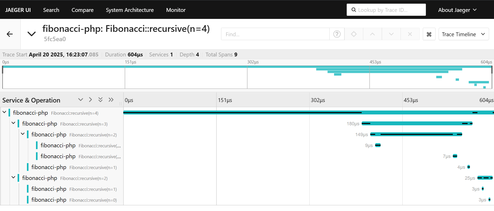
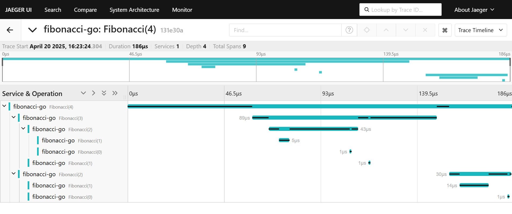
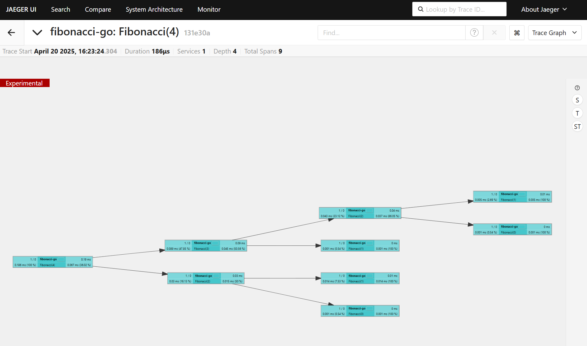
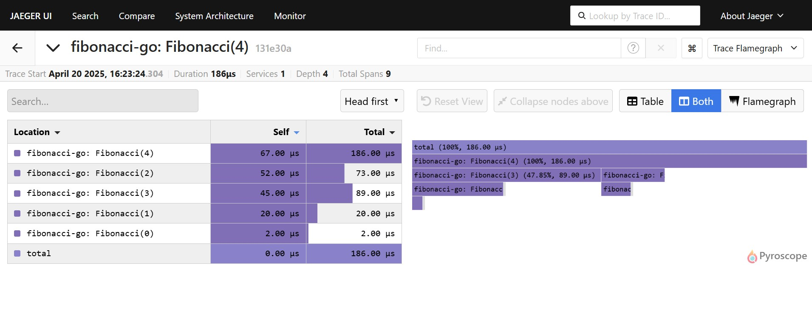

# OpenTelemetry + Jaeger: Golang/PHP Demo 

It is a simple demo to show how to use OpenTelemetry with Jaeger in Golang and PHP  
that generates traces spans and sends them to Jaeger.  

## Installation
- `docker compose up --build`

## PHP
- http://localhost:8081/?n=4

## Golang
- http://localhost:8080/fib?n=4

- 
- 

## Jaeger
- http://localhost:16686
