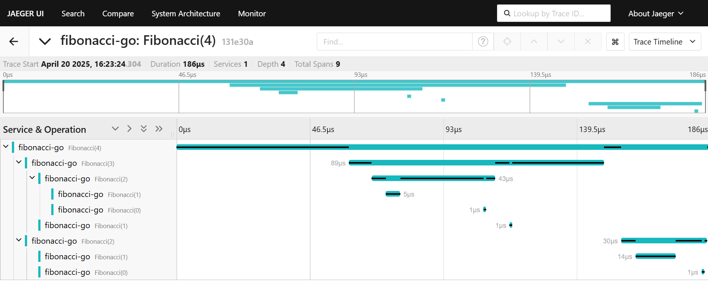
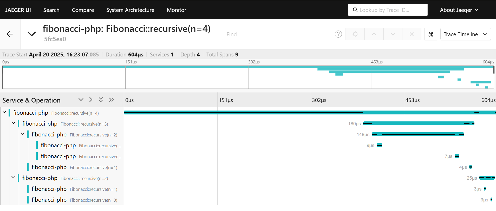

# OpenTelemetry + Jaeger — Go/PHP trace demo

[](https://github.com/dionisvl/my.OpenTelemetry-Jaeger-example/actions/workflows/ci.yml)

A compact polyglot observability demo: equivalent Fibonacci HTTP services in Go and PHP export OTLP traces to Jaeger. It makes SDK setup, resource attributes and nested spans easy to compare across both stacks.

## Data flow

```text
browser / curl
  ├─> Go service  :8080 ──OTLP/HTTP──┐
  └─> PHP service :8081 ──OTLP/HTTP──┼─> Jaeger collector :4318
                                      └─> Jaeger UI :16686
```

Each Fibonacci call creates nested spans. Jaeger shows the call tree, duration and attributes such as the input and calculated result.

## Quick start

```bash
cp .env.example .env
docker compose up --build
```

- Go: [localhost:8080/fib?n=4](http://localhost:8080/fib?n=4)
- PHP: [localhost:8081/?n=4](http://localhost:8081/?n=4)
- Jaeger: [localhost:16686](http://localhost:16686)

## What to inspect

1. Call either service with several values of `n`.
2. Open Jaeger and select `fibonacci-go` or the PHP service.
3. Compare the nested spans and their `n`/`result` attributes.
4. Point `OTEL_EXPORTER_OTLP_ENDPOINT` at an external collector when needed.

## Project layout

```text
.
├── compose.yml       # Go, PHP and Jaeger services
├── .env.example      # collector endpoint template
├── go/               # Go OpenTelemetry SDK example
├── php/              # PHP OpenTelemetry SDK example
└── imgs/             # example traces and service views
```

## Screenshots





## Production notes

This repository intentionally stays small. A production setup should add sampling policy, authentication/TLS for OTLP, batching limits, retries, semantic HTTP attributes and collector-level routing/export configuration.

## License

MIT — see [LICENSE](LICENSE).
